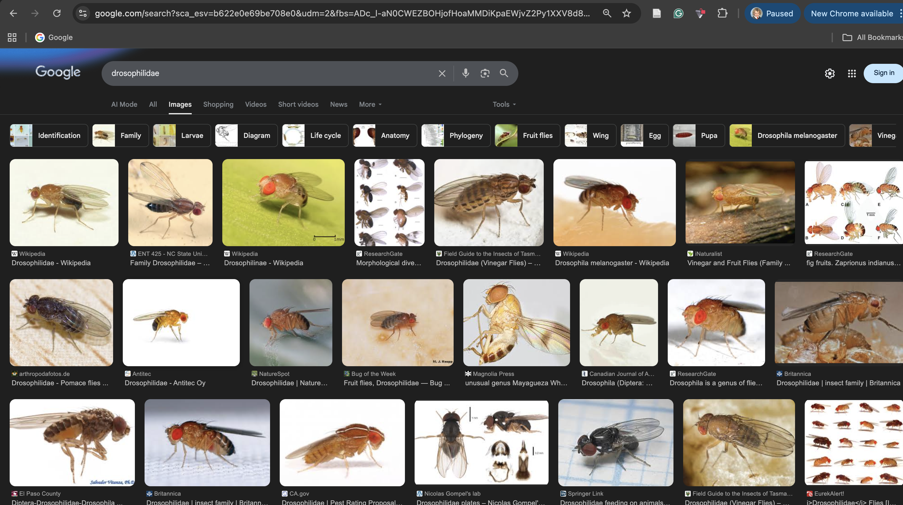
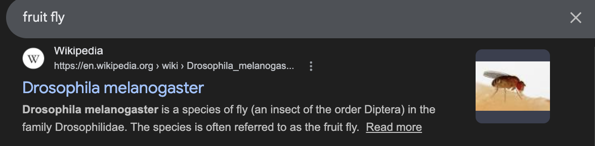
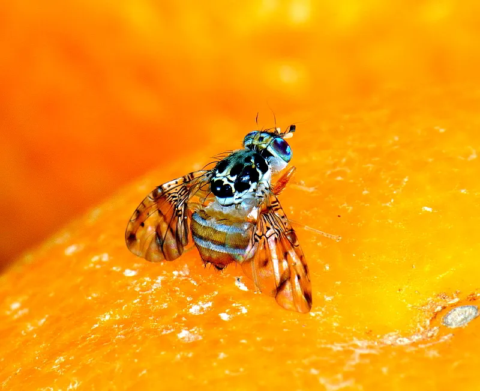
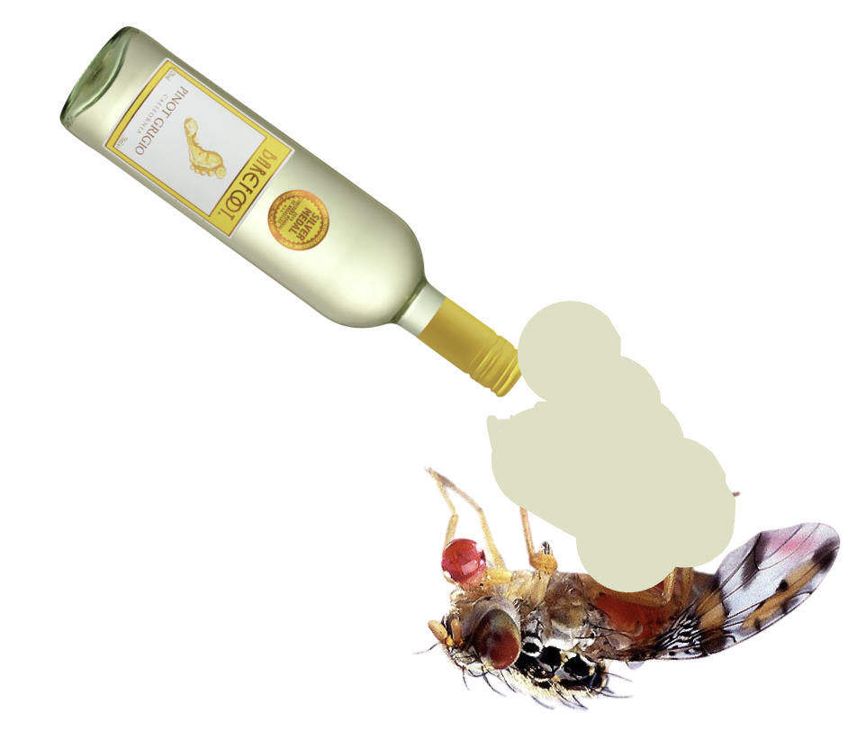
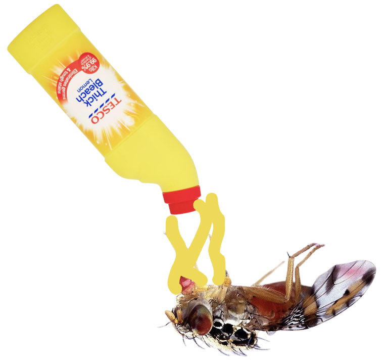
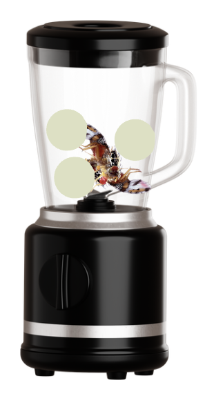
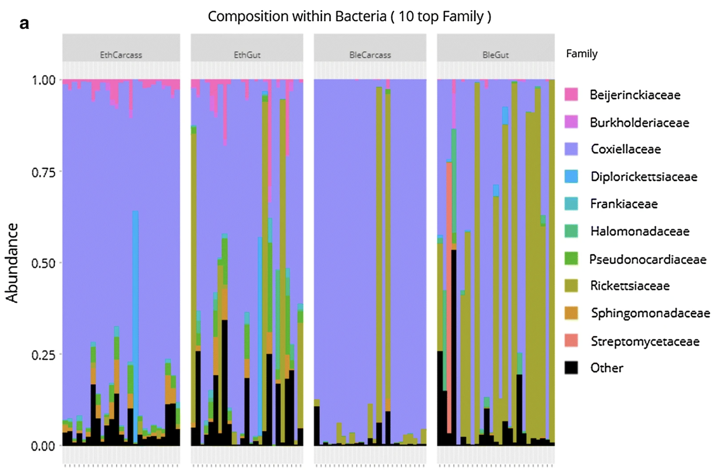
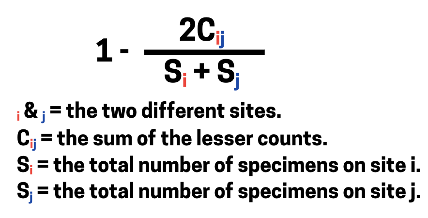
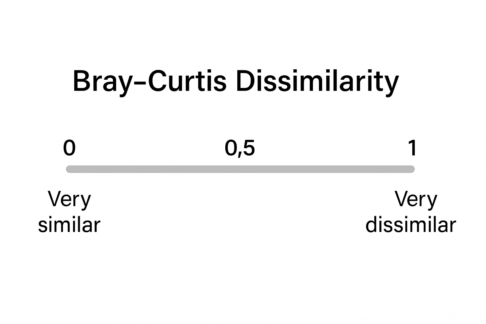

## The lab presentation today.

-   The current progress, and a background to my work on **"Host-microbe symbioses in Tephritid pest insects"**.

::: fragment
-   This will be an interactive, please scan the QR code, or follow the link on the Teams chat.
:::

::: fragment
-   You will have been given a Medfly or a Drosophila sticker, this is your team.
:::

::: fragment
-   The team with the winning points? The {width="10%"}
:::

## Fruit flies?

::: fragment
-   Within fruit flies, we have the two families; Drosophilidae, {width="30%"}
:::

::: fragment
and Tephritidae {width="40%"}
:::

## Fruit flies?

-   Drosophilidae, is arguably what the 'average person' would think of when they say fruit flies. {width="40%"}

::: fragment
-   Tephritidiae, on the other hand are slightly less common. I think?
:::

## Tephritids

### A big background.

{width="70%"}

::: fragment
```         
-   They are actually sometimes called peacock flies, because they are colourful xD
```
:::

::: fragment
-   Tephritidae contain most of the flies that cause economic damage to crops because some feed on **living tissue**, they go after fresh fruits, plants, etc.
:::

::: fragment
-   They do this through their ovipositor. Its larvae feed and develop on many deciduous, subtropical, and tropical fruits and some vegetables.
:::

## Tephritids

### The Medfly.

::: fragment
-   A common Tephritid, is the Mediterranean Fruit Fly (Medfly), ranked first among economically important fruit fly species.
:::

::: fragment
-   Originated in sub-Suharan Africa, it can tolerate cooler climates better than most other tropical fruit flies.
:::

::: fragment
-   Eradication efforts may be extremely expensive.
:::

## Quiz question time!

-   Please follow the first task, answer the questions don't say your total at the end.

    -   Navigation tips:

-   Don't refresh the page, you will lose your score.

## How we are looking at "Host-microbe symbioses in Tephritid pest insects"

::: fragment
-   

    1.  Surface sterilisation of Medflies.
:::

::: fragment
-   

    2.  Gut dissection of Medflies.
:::

::: fragment
-   

    3.  Can we do shotgun metagenomics in Medflies?
:::

## 1. Surface sterilisation of Medflies.

### Why do we surface sterilise?

::: fragment
-   Surface sterilisation is the process of washing the surface of the Medfly, dunking them.
:::

::: fragment
-   We want to know about the microbiota of the Medfly, but if we analyse the microbiota without washing it, we might be getting it's environment.
:::

## Step 1 - Surface sterilisations

### How should we surface sterilise?

::: fragment
-   Ethanol ? {width="20%"}
:::

::: fragment
-   Bleach ? {width="20%"}
:::

::: fragment
-   Ethanol and bleach are both effective at killing microbes, but **bleach** can actually denature DNA.
:::

::: fragment
-   So if ethanol allows DNA to remain, the DNA of the microbes could still be present. You blend this all up, there might still be external surface microbes.

{width="20%"}
:::

## Step 1 - Surface sterilisations

### How should we surface sterilise?

::: fragment
{width="50%"}
:::

::: fragment
<small> Binetruy et al. (2019) looked into methods of surface sterilisation in ticks. When testing bleach and ethanol, showed that when looking at external microbiome, revealed that ethanol-based surface sterilisation method is inefficient to eliminate the DNA of external bacteria. </small>
:::

## Quiz question time!

Please do this.

## Step 2 - Gut Dissections.

### Guts vs. Whole flies

::: fragment
-   In insect microbiota studies, studies usually vary whether using the whole gut, or the whole fly to analyse the microbiota.
:::

::: fragment
-   While some studies have shown that there is no difference between using the whole gut or the whole fly,
:::

::: fragment
-   Had to know how to properly do these.
:::

::: fragment
-   In sterile conditions.
:::

## Step 2 - Gut Dissections.

### Understanding the Tephritid gut.

::: fragment
-   In the gut, there is a Medfly gut.
:::

::: fragment
-   It has the foregut, midgut, and hindgut.
:::

::: fragment
-   Another reason for reduced microbial niches could be that foregut and hindgut regions are shed during moulting. During metamorphosis, the whole larval gut is substituted by a new adult gut.
:::

## Quiz question time!

Please do this.

## Step 3 - Shotgun Metagenomics.

### What is shotgun metagenomics?

::: fragment
-   In sequencing of the microbiota, the main methods are **amplicon metagenomics** and **shotgun metagenomics**.
:::

::: fragment
-   Amplicon metagenomics
:::

## Step 3 - Shotgun Metagenomics.

### Analysis of microbiota data - Diversity Metrics

::: fragment
-   In analysis of the microbiota, there are two diversity metrics. These are **Alpha Diversity** and **Beta Diversity**.
:::

::: fragment
-   Alpha diversity, is diversity within a sample. It how diverse or rich your microbiome sample is in terms of different microorganisms.
:::

::: fragment
-   Beta Diversity, is a measure of dissimilarity or similarity between **two different** communities.
:::

::: fragment
-   In this lab presentation, we will focus on Beta Diversity, and specifically a method called **Bray-Curtis Dissimilarity**
:::

## Step 3 - Shotgun Metagenomics.

### Analysis of microbiota data - Bray Curtis Disimiliarity

::: fragment
-   Bray-Curtis Dissimilarity can be described as a statistic used to quantify the **dissimilarity** in composition of species between **two** different sites. It works by a formula outputting a value between 0 and 1, with 0 meaning the sites are exactly the same, to very similar, and 1 being they are very dissimilar.
:::

::: fragment
-   The formula used in **Bray-Curtis Dissimilarity** is shown below:

```{r echo=FALSE, fig.align="center"}

```
:::

## Step 3 - Shotgun Metagenomics.

### Analysis of microbiota data - Bray-Curtis Dissimilarity in action

::: fragment
-   Lets go through an example of how **Bray-Curtis Dissimilarity** works, using data from [Darrington et al. (2022)](https://www.microbiologyresearch.org/content/journal/mgen/10.1099/mgen.0.000801#tab2).
:::

::: fragment
-   Because Bray-Curtis Dissimilarity is based on a calculation of two different sites, we will use Medfly larval samples taken from two different fruits (Argan 🌰 and Peach 🍑, taken from Morocco and Greece respectively). That have been sequenced through 16S rRNA sequencing.
:::

::: fragment
::: columns
::: {.column width="50%"}
**Sample 1 - Medfly from Morocco (Argan 🌰)**

**Bacterial composition (relative proportions):**

| Bacterium          | Proportion |
|--------------------|------------|
| *Klebsiella*       | 0.75       |
| *Pantonea*         | 0.15       |
| *Commensalibacter* | 0.10       |
:::

::: {.column width="50%"}
**Sample 2 - Medfly from Greece (Peach 🍑)**

**Bacterial composition (relative proportions):**

| Bacterium          | Proportion |
|--------------------|------------|
| *Klebsiella*       | 0.25       |
| *Pantonea*         | 0.50       |
| *Serratia*         | 0.05       |
| *Spinghobacterium* | 0.15       |
:::
:::
:::

## Step 3 - Shotgun Metagenomics.

### Analysis of microbiota data: Calculating Bray-Curtis Dissimilarity

C~ij~ = the sum of **lower** counts found at both sites

> C~ij~ = 0.25 + 0.15 = 0.4

The only bacteria these two samples have in common are *Klebsiella* and *Pantonea*, the lowest values of which are 0.25 of *Klebsiella* (from the peach samples), and 0.15 of *Pantonea* (from the argan samples).

S~i~ = total number on site i - Argan

> S~i~ = 0.75 + 0.15 + 0.1 = 1

S~j~ = total number on site j - Peach

> S~j~ = 0.25 + 0.5 + 0.05 + 0.15 = 1

Now that we have:

$$
C_{ij} = 0.4 \\
$$ $$
S_i = 1 \\
$$ $$
S_j = 1
$$

The Bray-Curtis formula is:

$$
BC_{ij} = 1 - \frac{2 C_{ij}}{S_i + S_j}
$$

Plugging in the values:

$$
BC_{ij} = 1 - \frac{2*0.4}{1 + 1}
$$

Calculate the division:

$$
\frac{0.8}{2} = 0.4
$$

Finally:

$$
BC_{ij} = 1 - 0.4 = \mathbf{0.6}
$$

## Step 3 - Shotgun Metagenomics.

### Analysis of microbiota data: Calculating Bray-Curtis Dissimilarity

::: fragment
**Interpretation:**

-   Using this formula we have worked out the Bray-Curtis Dissimilarity of the two Medfly microbiotas from Argan and Peach to be **0.6**.
:::

::: fragment
-   Now let's go into what this means. Below shows the scale, where Bray-Curtis dissimilarity will range from 0 - 1, with 1 being the largest amount of dissimilarity between the two samples.

```{r echo=FALSE, fig.align="center"}

```
:::

::: fragment
-   From the scale, we can conclude that two samples are not similar, not are they massively dissimilar. But they are more dissimilar than similar! You might be able to see this makes somewhat sense by going back to the dataframe. To put it simply, a Bray-Curtis dissimilarity of **0.6** indicates moderate dissimilarity between the two sites.
:::

## Step 3 - Shotgun Metagenomics.

### Analysis of microbiota data - NMDS

::: fragment
-   NMDS (Non-metric Multidimensional Scaling) is an **ordination** technique, which is used to visualise **similarities** or **dissimilarities** in data.
:::

::: fragment
-   NMDS is used to reduce the dimensionality of complex data sets, (i.e the abundance of microbes across different sites), to allow for visualisation in a 2D space, (although this can be 3D).
:::

::: fragment
-   **NMDS** is a non-linear method. It doesn't preserve actual distances between samples, but instead maintains the **rank order of those distances**, which is especially useful when working with complex samples, such as in ecological or microbial community data.
:::

## Step 3 - Shotgun Metagenomics.

### Analysis of microbiota data - Let's go through the steps

::: fragment
We can do this in R... We will need these two packages

```{r, echo=TRUE, message=FALSE, warning=FALSE,  eval=F, echo = T }
# Let's get our bacteria dataframe again
library(vegan)
library(tidyverse)
```
:::

::: fragment
We will then need a dataframe These bacteria aren't proportional, they are just amounts (don't overthink it)

```{r, echo=TRUE, message=FALSE, warning=FALSE,  eval=F, echo = T }
bacteria_df <- data.frame(
  Klebsiella = c(0.75, 0.25, 0.5, 0.7, 0.3, 0.75),
  Pantonea = c(0.15, 0.50, 0.05, 0.03, 0.02, 0.05),
  Commensalibacter = c(0.10, 0.02, 0.01, 0.01, 0.01, 0.01),
  Serratia = c(0.01, 0.05, 0.01, 0.01, 0.02, 0.01),
  Spinghobacterium = c(0.01, 0.15, 0.01, 0.02, 0.01, 0.01),
  Acinetobacter = c(0.02, 0.01, 0.01, 0.01, 0.5, 0.01)
)
```
:::

::: fragment
This part will need a bit more breaking downis 

```{r, echo=TRUE, message=FALSE, warning=FALSE,  eval=F, echo = T }
invisible(capture.output(
  nmds <- metaMDS(bacteria_df, distance = "bray", k = 2, trymax = 100)
))
```


The `metaMDS()` function:

-   The `metaMDS()` function performs NMDS by using multiple random starts to find a stable solution.

-   It standardises the output for easier interpretation and adds species scores to the site ordination. While `metaMDS()` itself doesn't directly compute NMDS - when we add the relevant information inside this function, it will.

-   We have set `k = 2` because we want to reduce the data to two dimensions (simplifying the data).

-   The `trymax` parameter, set to 100 increases the number of "random starts" to help the algorithm find a stable, low-stress solution (stress is something we will go into more detail on in a bit).
:::


## Step 3 - Shotgun Metagenomics.

### Analysis of microbiota data - getting the plot


::: fragment
```{r, echo=TRUE, message=FALSE, warning=FALSE,  eval=F, echo = T }
nmds_scores <- as.data.frame(scores(nmds, display = "sites"))
```
```{r}
nmds_scores <- data.frame(
  NMDS1 = c(-0.3322709,
            0.7018915,
            -0.0391868,
            -0.3964679,
            0.4761638,
            -0.4101297),
  NMDS2 = c(-0.17354187,
            -0.57838356,
            0.26561393,
            -0.06633933,
            0.63079017,
            -0.07813934)
)

nmds_scores
```


This is a process of extracting the site scores, for us - the site is the fruit which the flies are on 
so based off the nmds values generated above, it will extract these ordination scores 
::: 

::: fragment
```{r, echo=TRUE, message=FALSE, warning=FALSE,  eval=F, echo = T }
nmds_scores$Fruit <- c("Argan", "Peach", "Apricot", "Grapefruit", "Orange", "Tangerine")
```
This part simply assigns our scores to the fruits 
::: 

::: fragment
```{r, echo=TRUE, message=FALSE, warning=FALSE,  eval=F, echo = T }

nmds_plot <- ggplot(nmds_scores,
                    aes(x = NMDS1, y = NMDS2, colour = Fruit)) +
  geom_point(size = 4) +
  theme_minimal() +
  labs(title = "NMDS Plot of Bacterial Composition",
       subtitle = "Colored by Fruit Type",
       x = "NMDS1", y = "NMDS2")
       
```
Finally, we can output our plot 
::: 


## Step 3 - Shotgun Metagenomics.

### Analysis of microbiota data - Outputting this

::: {.column width="40%"}
```{r, echo=TRUE, message=FALSE, warning=FALSE,  eval=F, echo = T }
# Let's get our bacteria dataframe again
library(vegan)
library(tidyverse)

bacteria_df <- data.frame(
  Klebsiella = c(0.75, 0.25, 0.5, 0.7, 0.3, 0.75),
  Pantonea = c(0.15, 0.50, 0.05, 0.03, 0.02, 0.05),
  Commensalibacter = c(0.10, 0.02, 0.01, 0.01, 0.01, 0.01),
  Serratia = c(0.01, 0.05, 0.01, 0.01, 0.02, 0.01),
  Spinghobacterium = c(0.01, 0.15, 0.01, 0.02, 0.01, 0.01),
  Acinetobacter = c(0.02, 0.01, 0.01, 0.01, 0.5, 0.01)
)

# Use metaMDS to generate the ordination with lowest stress
invisible(capture.output(
  nmds <- metaMDS(bacteria_df, distance = "bray", k = 2, trymax = 100)
))

# Extract site scores
nmds_scores <- as.data.frame(scores(nmds, display = "sites"))

# Add fruit names
nmds_scores$Fruit <- c("Argan", "Peach", "Apricot", "Grapefruit", "Orange", "Tangerine")

# Plot the NMDS results
nmds_plot <- ggplot(nmds_scores,
                    aes(x = NMDS1, y = NMDS2, colour = Fruit)) +
  geom_point(size = 4) +
  theme_minimal() +
  labs(title = "NMDS Plot of Bacterial Composition",
       subtitle = "Colored by Fruit Type",
       x = "NMDS1", y = "NMDS2")


```
:::

::: {.column width="60%"}
```{r, echo=FALSE, message=FALSE, warning=FALSE, results = 'hide',  eval=T,echo = F }
library(vegan)
library(ggplot2)

bacteria_df <- data.frame(
  Klebsiella = c(0.75, 0.25, 0.5, 0.7, 0.3, 0.75),
  Pantonea = c(0.15, 0.50, 0.05, 0.03, 0.02, 0.05),
  Commensalibacter = c(0.10, 0.02, 0.01, 0.01, 0.01, 0.01),
  Serratia = c(0.01, 0.05, 0.01, 0.01, 0.02, 0.01),
  Spinghobacterium = c(0.01, 0.15, 0.01, 0.02, 0.01, 0.01),
  Acinetobacter = c(0.02, 0.01, 0.01, 0.01, 0.5, 0.01)
)


nmds <- metaMDS(bacteria_df, distance = "bray", k = 2, trymax = 100)

nmds_scores <- as.data.frame(scores(nmds, display = "sites"))

nmds_scores$Fruit <- c("Argan", "Peach", "Apricot", "Grapefruit", "Orange", "Tangerine")


nmds_plot <- ggplot(nmds_scores, 
                    aes(x = NMDS1, y = NMDS2, color = Fruit, label = Fruit)) +
  geom_point(size = 4) + 
  theme_minimal() + 
  labs(title = "NMDS Plot of Bacterial Composition", 
       subtitle = "Colored by Fruit Type",
       x = "NMDS1", y = "NMDS2")

nmds_plot
```
:::
