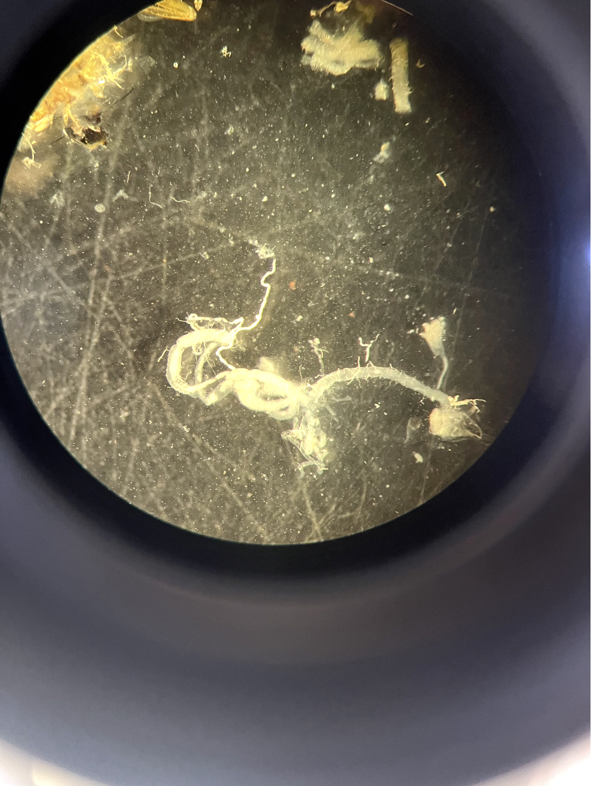

## The QR code to scan if you haven't accessed the quiz:

{width="30%"}

## Today's Lab Meeting

::: fragment
**Today I'll share:**

-   Work related to my PhD project: **Host--microbe symbioses in Tephritid pest insects**.

-   Including my current progress.

-   A background to my project including key techniques I'll use during my PhD, including **microbiota analysis.**
:::

## What you need to do:

**This will be interactive!**

-   Please **QR code** or follow the **Teams chat** to participate.

::: fragment
**Team work!!**

-   You should have received either a *Medfly* or *Drosophila* sticker, this is your team **team**.
:::

::: fragment
**Prizes...**

-   To ensure no one feels left out, there will be prizes for all.

-   Both prizes for the winning team, and the runners up.

-   One way or another, you will all feel like winners.

{width="24%"}
:::

## Beginning with fruit flies. 

::: fragment
-   Within fruit flies, we have the two families; Drosophilidae, {width="30%"}
:::

::: fragment
and Tephritidae {width="40%"}
:::

## The fruit fly families.

-   **Drosophilidae** --- what most people think of as "fruit flies"\
    {width="40%"}

::: fragment
-   **Tephritidae** are less common, but very *important* agriculturally.
:::

## Background

::: fragment
-   Sometimes called **peacock flies** due to their colorful patterns.
:::

::: fragment
-   Most Tephritids cause **economic damage to crops** because some feed on **living tissue**;targeting fresh fruits, vegetables, and plants.
:::

::: fragment
-   They use their **ovipositor** to lay eggs; which then develop into larvae in many different fruits.
:::

## Tephritids: The Medfly

::: fragment
{width="60%"}
:::

::: fragment
-   **Mediterranean Fruit Fly (Medfly)** is a common Tephritid and ranked first among economically important fruit flies.
:::

::: fragment
-   Originated in **sub-Saharan Africa**, but tolerates cooler climates better than most tropical fruit flies.
:::

::: fragment
-   Eradication efforts are extremely costly.
:::

## Quiz question time - Round 1!

-   It is now time for the first round of the quiz!

::: fragment
-   Here are some tips and rules:

    -   Answer the questions as you go along, then click Submit.

    -   For each question, you will be told if your answer is incorrect or correct, do not try again - this is cheating.

    -   Do not refresh the page, this will reset everything and is cheating.

    -   When you have answered all questions, at the bottom of your page, your total points for this round will be on your screen. Please share this, and do not cheat!!
:::

## How I have been understanding **Host--microbe symbioses in Tephritid pest insects**

::: fragment
1.  Surface sterilisation of Medflies.
:::

::: fragment
2.  Dissection of Medfly guts.
:::

::: fragment
3.  Microbial analysis techniques.
:::

## What is surface sterilisation?

::: fragment
-   Surface sterilisation removes microbes present on the external surface of the Medfly.
:::

::: fragment
-   The aim is to analyse the internal microbiota (gut microbiota), not whatever it has been chilling around in.\
:::

::: fragment
-   If we do not wash the flies, DNA from environmental microbes may contaminate the sample.\
:::

## Choosing a sterilisation method.

::: fragment
-   Ethanol {width="60%"}
:::

::: fragment
-   Bleach {width="60%"}
:::

::: fragment
-   Both ethanol and bleach will kill microbes.
:::

::: fragment
-   However, bleach denatures DNA, while ethanol does not. So if ethanol is used alone, DNA from external microbes may remain, even if the microbes are dead.
:::

::: fragment
-   For example, if a whole fly was surface sterilised with ethanol, and the whole fly was homogenised, the external DNA would also most likely be in the sample.

{width="20%"}
:::

## Evidence from other studies.

::: fragment
A study by Binetruy et al. (2019) evaluated sterilisation methods in ticks
:::

::: fragment
Their results showed that

-   Ethanol based sterilisation did not fully remove external bacterial DNA.
-   Bleach based methods were more effective at elimninating external contamination.
:::

::: fragment
{width="50%"}
:::

## Choosing a protocol

::: fragment
After using the above paper as a source, we developed a protocol that would involve testing the sterility of the fly using incubated LB plates.
:::

::: fragment
We decided on a set protocol:

- 1 min 30 sec bleach in bijou tube, mixing on vortex — remove
- 30 sec PBS, mixing on vortex — remove
- 30 sec PBS, mixing on vortex — remove
- 30 sec PBS, mixing on vortex — remove
:::


## How it went

::: fragment
- Leaving the fly in bleach for longer than 1:30–2:00 may break appendages
- Wash must be under 1 min to avoid gut exposure ruining experiment
:::


## Results

::: fragment
This also seemed to result in flies that were not actually clean...
:::

::: fragment
{width="100%"}
:::
::: column
{width="100%"}
:::
:::
:::


## Table of Results

So after many trials and errors:

```{r}
library(readr)
library(knitr)
library(kableExtra)

sterilisation <- read_csv("SurfaceSterilisation_Experiments.csv")

kable(sterilisation) %>%
  kable_styling(font_size = 12)
```

::: fragment
-   We eventually found that using filter paper to on top of the bijou tube, allowing the solution to drain through so the flies could be more easily picked up, actually resulted in having sterile flies, and clean plates.
:::

## Quiz question time!

Please do this.

## Guts vs. Whole flies

::: fragment
-   In insect microbiota studies, studies usually vary whether using the whole gut, or the whole fly to analyse the microbiota.
:::

::: fragment
-   Some studies have shown that there is no difference between using the whole gut or the whole fly, but there is still argument that you're missing a lot with getting whole fly bacteria, rather than just gut bacteria.
:::

::: fragment
-   Even if flies are surface-sterilised, whole-fly samples may still include microbes from tissues like the reproductive organs, this could dilute the presence of actual gut bacteria. Some studies have even shown that in Tephritids, there are differences between gut and reproductive organs.
:::

::: fragment
-   We decided to focus on just guts, and not whole flies.
:::

::: fragment

:::


## Gut Dissection

-   Foregut
-   Midgut
-   Hindgut


::: fragment
{width="40%"}
:::

## Understanding the Medfly gut.

::: fragment
-   It has the foregut, midgut, and hindgut.
:::

::: fragment
-   During metamorphosis, the entire larval gut is broken down and replaced with a newly formed adult gut.
-   This can influence forms of transmission throughout life stages.
:::

## Understanding the Medfly gut.

::: fragment
-   It has the foregut, midgut, and hindgut.
:::

::: fragment
-   During metamorphosis, the entire larval gut is broken down and replaced with a newly formed adult gut.
-   This can influence forms of transmission throughout life stages.
:::

## Modes of microbial transmission

::: fragment
-   There are 3 modes of microbial transmission.
:::

::: fragment
-   **Vertical transmission** -- microbes are passed directly from parent to offspring (via the egg surface or reproductive tissues).
:::

::: fragment
-   **Horizontal transmission** -- microbes are acquired from other individuals (via mating, shared feeding sites etc).
:::

::: fragment
-   **Environmental transmission** -- microbes are acquired from the surrounding environment (host fruit, soil, or artificial diet substrate in the lab).
:::

::: fragment
-   All of these together are referred to as **mixed modes of microbial transmission**.
:::

::: fragment
-   In Medfly, it has been **suggested** that horizontal transmission occurs.
-   Larvae have been shown to shed bacteria into the fruit substrate, and other larvae may acquire those microbes from the shared environment (the fruit).
:::

::: fragment
-   However, similar to vertical transmission, this has not been directly proven.
-   This could be tested using a high-throughput sequencing approach to identify identical bacterial strains shared between hosts.
:::

::: fragment
-   The current data on transmission in Medfly doesn't truly show that bacteria between hosts are identical.
:::

## Quiz question time!

Please do this.

## Diversity Metrics

::: fragment
-   In analysis of the microbiota, there are two diversity metrics. These are **Alpha Diversity** and **Beta Diversity**.
:::

::: fragment
-   Alpha diversity, is diversity within a sample. It how diverse or rich your microbiome sample is in terms of different microorganisms.
:::

::: fragment
-   Beta Diversity, is a measure of dissimilarity or similarity between **two different** communities.
:::

::: fragment
-   In this lab presentation, we will focus on Beta Diversity, and specifically a method called **Bray-Curtis Dissimilarity**
:::

## Diversity Metrics - Bray Curtis Disimiliarity

::: fragment
-   Bray-Curtis Dissimilarity can be described as a statistic used to quantify the **dissimilarity** in composition of species between **two** different sites.

-   It works by a formula outputting a value between 0 and 1, with 0 meaning the sites are exactly the same, to very similar, and 1 being they are very dissimilar.

-   It works on species abundance.
:::

::: fragment
-   The formula used in **Bray-Curtis Dissimilarity** is shown below:

```{r echo=FALSE, fig.align="center"}
knitr::include_graphics("images/mathsanalysis.png")
```
:::

## Analysis of microbiota data - Bray-Curtis Dissimilarity in action

::: fragment
-   Lets go through an example of how **Bray-Curtis Dissimilarity** works, using data from [Darrington et al. (2022)](https://www.microbiologyresearch.org/content/journal/mgen/10.1099/mgen.0.000801#tab2).
:::

::: fragment
-   Because Bray-Curtis Dissimilarity is based on a calculation of two different sites, we will use Medfly larval samples taken from two different fruits (Argan 🌰 and Peach 🍑, taken from Morocco and Greece respectively). That have been sequenced through 16S rRNA sequencing.
:::

::: fragment
::: columns
::: {.column width="50%"}
**Sample 1 - Medfly from Morocco (Argan 🌰)**

**Bacterial composition (relative proportions):**

| Bacterium          | Proportion |
|--------------------|------------|
| *Klebsiella*       | 0.75       |
| *Pantonea*         | 0.15       |
| *Commensalibacter* | 0.10       |
:::

::: {.column width="50%"}
**Sample 2 - Medfly from Greece (Peach 🍑)**

**Bacterial composition (relative proportions):**

| Bacterium          | Proportion |
|--------------------|------------|
| *Klebsiella*       | 0.25       |
| *Pantonea*         | 0.50       |
| *Serratia*         | 0.05       |
| *Spinghobacterium* | 0.15       |
:::
:::
:::

## Analysis of microbiota data: Calculating Bray-Curtis Dissimilarity

C~ij~ = the sum of **lower** counts found at both sites

> C~ij~ = 0.25 + 0.15 = 0.4

The only bacteria these two samples have in common are *Klebsiella* and *Pantonea*, the lowest values of which are 0.25 of *Klebsiella* (from the peach samples), and 0.15 of *Pantonea* (from the argan samples).

S~i~ = total number on site i - Argan

> S~i~ = 0.75 + 0.15 + 0.1 = 1

S~j~ = total number on site j - Peach

> S~j~ = 0.25 + 0.5 + 0.05 + 0.15 = 1

Now that we have:

$$
C_{ij} = 0.4 \\
$$ $$
S_i = 1 \\
$$ $$
S_j = 1
$$

The Bray-Curtis formula is:

$$
BC_{ij} = 1 - \frac{2 C_{ij}}{S_i + S_j}
$$

Plugging in the values:

$$
BC_{ij} = 1 - \frac{2*0.4}{1 + 1}
$$

Calculate the division:

$$
\frac{0.8}{2} = 0.4
$$

Finally:

$$
BC_{ij} = 1 - 0.4 = \mathbf{0.6}
$$

## Analysis of microbiota data: Calculating Bray-Curtis Dissimilarity

::: fragment
**Interpretation:**

-   Using this formula we have worked out the Bray-Curtis Dissimilarity of the two Medfly microbiotas from Argan and Peach to be **0.6**.
:::

::: fragment
-   Now let's go into what this means. Below shows the scale, where Bray-Curtis dissimilarity will range from 0 - 1, with 1 being the largest amount of dissimilarity between the two samples.

```{r echo=FALSE, fig.align="center"}
knitr::include_graphics("images/braycurtisscale.png")
```
:::

::: fragment
-   From the scale, we can conclude that two samples are not similar, not are they massively dissimilar. But they are more dissimilar than similar! You might be able to see this makes somewhat sense by going back to the dataframe. To put it simply, a Bray-Curtis dissimilarity of **0.6** indicates moderate dissimilarity between the two sites.
:::

## Analysis of microbiota data: NMDS

::: fragment
-   NMDS (Non-metric Multidimensional Scaling) is an **ordination** technique, which is used to visualise **similarities** or **dissimilarities** in data.
:::

::: fragment
-   NMDS is used to reduce the dimensionality of complex data sets, (i.e the abundance of microbes across different sites), to allow for visualisation in a 2D space, (although this can be 3D).
:::

::: fragment
-   **NMDS** is a non-linear method. It doesn't preserve actual distances between samples, but instead maintains the **rank order of those distances**, which is especially useful when working with complex samples, such as in ecological or microbial community data.
:::

## Analysis of microbiota data - Let's go through the steps

::: fragment
1.  **Calculate a dissimilarity matrix**\
    Use a dissimilarity measure (e.g., *Bray-Curtis*) to quantify differences between all sample pairs based on multivariate data (e.g., species abundance).

2.  **Rank the dissimilarity values**\
    Convert the dissimilarity matrix into *ranked distances*, from most similar to least similar.

3.  **Initialise with random coordinates**\
    I an a new 2D space, put samples at **random** starting positions in a low-dimensional space.

4.  **Calculate Euclidean distances**\
    Measure the *Euclidean distances* between all pairs of these random points in the reduced space.

5.  **Rank the Euclidean distances**\
    Rank these distances like done with the original dissimilarity differences in **Step 2**.

6.  **Compare ranked distances using Kruskal's stress**\
    Use Kruskal's stress function to compare the ranked dissimilarities with the ranked Euclidean distances. This metric quantifies how well the configuration preserves the order of the original dissimilarities.

7.  **Iteratively minimise stress**\
    Adjust the configuration repeatedly to *minimise stress*. If the stress is too high, this will be repeated new random configurations.

8.  **Obtain the NMDS solution**\
    The configuration with the *lowest stress* provides the final *NMDS scores* --- a best-fit representation of the rank-based dissimilarities in reduced space.

9.  **Visualise the results**\
    Plot the NMDS scores in 2D (or 3D) space, where the *distance between points* reflects the *relative dissimilarity* between samples.
:::

::: fragment
We can do this in R... We will need these two packages

```{r, echo=TRUE, message=FALSE, warning=FALSE,  eval=F, echo = T }
# Let's get our bacteria dataframe again
library(vegan)
library(tidyverse)
```
:::

::: fragment
We will then need a dataframe These bacteria aren't proportional, they are just amounts (don't overthink it)

```{r, echo=TRUE, message=FALSE, warning=FALSE,  eval=F, echo = T }
bacteria_df <- data.frame(
  Klebsiella = c(0.75, 0.25, 0.5, 0.7, 0.3, 0.75),
  Pantonea = c(0.15, 0.50, 0.05, 0.03, 0.02, 0.05),
  Commensalibacter = c(0.10, 0.02, 0.01, 0.01, 0.01, 0.01),
  Serratia = c(0.01, 0.05, 0.01, 0.01, 0.02, 0.01),
  Spinghobacterium = c(0.01, 0.15, 0.01, 0.02, 0.01, 0.01),
  Acinetobacter = c(0.02, 0.01, 0.01, 0.01, 0.5, 0.01)
)
```
:::

::: fragment
This part will need a bit more breaking downis

```{r, echo=TRUE, message=FALSE, warning=FALSE,  eval=F, echo = T }
invisible(capture.output(
  nmds <- metaMDS(bacteria_df, distance = "bray", k = 2, trymax = 100)
))
```

The `metaMDS()` function:

-   The `metaMDS()` function performs NMDS by using multiple random starts to find a stable solution.

-   It standardises the output for easier interpretation and adds species scores to the site ordination. While `metaMDS()` itself doesn't directly compute NMDS - when we add the relevant information inside this function, it will.

-   We have set `k = 2` because we want to reduce the data to two dimensions (simplifying the data).

-   The `trymax` parameter, set to 100 increases the number of "random starts" to help the algorithm find a stable, "low-stress" solution.
:::

## Analysis of microbiota data - getting the plot

::: fragment
```{r, echo=TRUE, message=FALSE, warning=FALSE,  eval=F, echo = T }
nmds_scores <- as.data.frame(scores(nmds, display = "sites"))
```

```{r}
nmds_scores <- data.frame(
  NMDS1 = c(-0.3322709,
            0.7018915,
            -0.0391868,
            -0.3964679,
            0.4761638,
            -0.4101297),
  NMDS2 = c(-0.17354187,
            -0.57838356,
            0.26561393,
            -0.06633933,
            0.63079017,
            -0.07813934)
)

nmds_scores
```

This is a process of extracting the site scores, for us - the site is the fruit which the flies are on so based off the nmds values generated above, it will extract these ordination scores
:::

::: fragment
```{r, echo=TRUE, message=FALSE, warning=FALSE,  eval=F, echo = T }
nmds_scores$Fruit <- c("Argan", "Peach", "Apricot", "Grapefruit", "Orange", "Tangerine")
```

This part simply assigns our scores to the fruits
:::

::: fragment
```{r, echo=TRUE, message=FALSE, warning=FALSE,  eval=F, echo = T }

nmds_plot <- ggplot(nmds_scores,
                    aes(x = NMDS1, y = NMDS2, colour = Fruit)) +
  geom_point(size = 4) +
  theme_minimal() +
  labs(title = "NMDS Plot of Bacterial Composition",
       subtitle = "Colored by Fruit Type",
       x = "NMDS1", y = "NMDS2")
       
```

Finally, we can output our plot
:::

## Analysis of microbiota data - Outputting this

::: {.column width="40%"}
```{r, echo=TRUE, message=FALSE, warning=FALSE,  eval=F, echo = T }
# Let's get our bacteria dataframe again
library(vegan)
library(tidyverse)

bacteria_df <- data.frame(
  Klebsiella = c(0.75, 0.25, 0.5, 0.7, 0.3, 0.75),
  Pantonea = c(0.15, 0.50, 0.05, 0.03, 0.02, 0.05),
  Commensalibacter = c(0.10, 0.02, 0.01, 0.01, 0.01, 0.01),
  Serratia = c(0.01, 0.05, 0.01, 0.01, 0.02, 0.01),
  Spinghobacterium = c(0.01, 0.15, 0.01, 0.02, 0.01, 0.01),
  Acinetobacter = c(0.02, 0.01, 0.01, 0.01, 0.5, 0.01)
)

# Use metaMDS to generate the ordination with lowest stress
invisible(capture.output(
  nmds <- c(bacteria_df, distance = "bray", k = 2, trymax = 100)
))

# Extract site scores
nmds_scores <- as.data.frame(scores(nmds, display = "sites"))

# Add fruit names
nmds_scores$Fruit <- c("Argan", "Peach", "Apricot", "Grapefruit", "Orange", "Tangerine")

# Plot the NMDS results
nmds_plot <- ggplot(nmds_scores,
                    aes(x = NMDS1, y = NMDS2, colour = Fruit)) +
  geom_point(size = 4) +
  theme_minimal() +
  labs(title = "NMDS Plot of Bacterial Composition",
       subtitle = "Colored by Fruit Type",
       x = "NMDS1", y = "NMDS2")


```
:::

::: {.column width="60%"}
```{r, echo=FALSE, message=FALSE, warning=FALSE, results = 'hide',  eval=T,echo = F }
library(vegan)
library(ggplot2)

bacteria_df <- data.frame(
  Klebsiella = c(0.75, 0.25, 0.5, 0.7, 0.3, 0.75),
  Pantonea = c(0.15, 0.50, 0.05, 0.03, 0.02, 0.05),
  Commensalibacter = c(0.10, 0.02, 0.01, 0.01, 0.01, 0.01),
  Serratia = c(0.01, 0.05, 0.01, 0.01, 0.02, 0.01),
  Spinghobacterium = c(0.01, 0.15, 0.01, 0.02, 0.01, 0.01),
  Acinetobacter = c(0.02, 0.01, 0.01, 0.01, 0.5, 0.01)
)


nmds <- metaMDS(bacteria_df, distance = "bray", k = 2, trymax = 100)

nmds_scores <- as.data.frame(scores(nmds, display = "sites"))

nmds_scores$Fruit <- c("Argan", "Peach", "Apricot", "Grapefruit", "Orange", "Tangerine")


nmds_plot <- ggplot(nmds_scores, 
                    aes(x = NMDS1, y = NMDS2, color = Fruit, label = Fruit)) +
  geom_point(size = 4) + 
  theme_minimal() + 
  labs(title = "NMDS Plot of Bacterial Composition", 
       subtitle = "Colored by Fruit Type",
       x = "NMDS1", y = "NMDS2")

nmds_plot
```
:::
